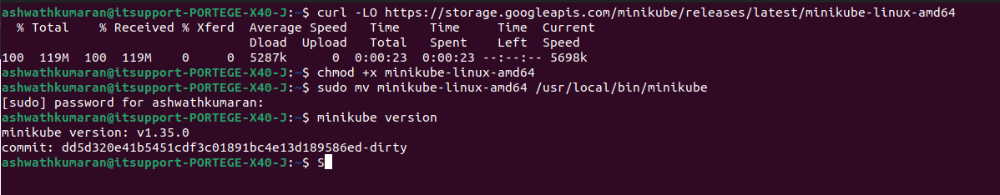
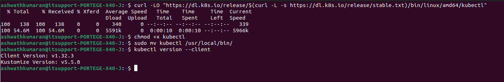
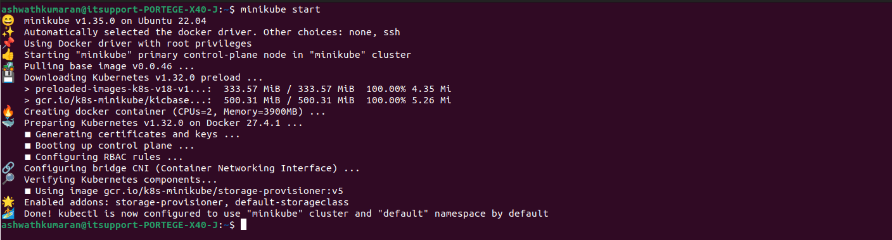

# Understanding-Kubernetes
Gaining foundational knowledge of Kubernetes, including container orchestration, deployment management, and scaling applications efficiently.
An application build on dotnet 8 with fully containerized and ready to deploy state taken from another git repo and deployed in the bare-metal kubernetes cluster. Attched the link of the pitstop application for referance.
https://github.com/EdwinVW/pitstop

### Setting up minikube

```bash
curl -LO https://storage.googleapis.com/minikube/releases/latest/minikube-linux-amd64

chmod +x minikube-linux-amd64

sudo mv minikube-linux-amd64 /usr/local/bin/minikube

minikube version
```



### Setting up kubectl

```bash
curl -LO "https://dl.k8s.io/release/$(curl -L -s https://dl.k8s.io/release/stable.txt)/bin/linux/amd64/kubectl"

chmod +x kubectl

sudo mv kubectl /usr/local/bin/

kubectl version --client
```



### Setting up Kubernetes cluster

```bash
minikube start
```


